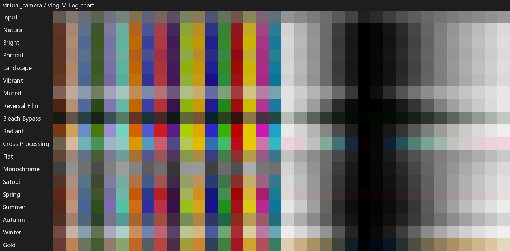
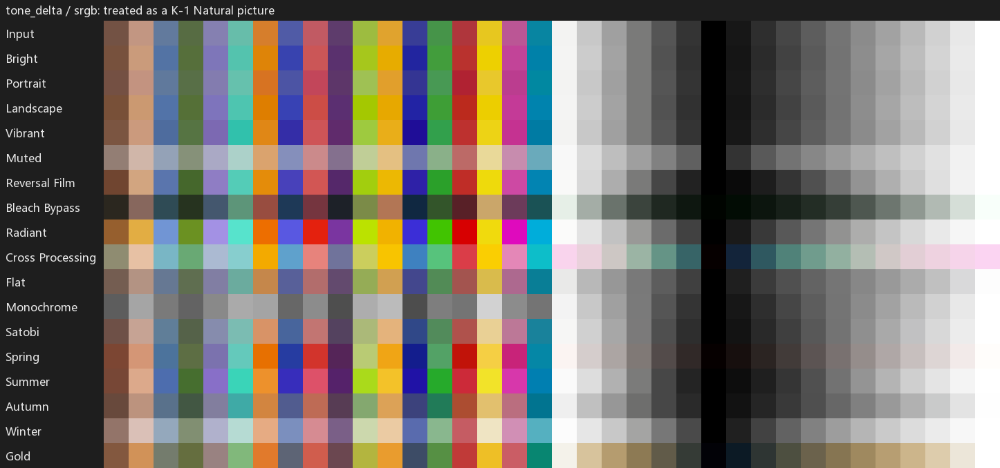

# Custom Image LUTs (33³)

3D LUTs (`.cube`) that approximate the look of Pentax Custom Image modes.
Output is always sRGB display-encoded. Built with the help of an LLM; accuracy is not guaranteed.
They were calibrated against one K-1 body's in-camera JPEGs and ColorChecker shots taken alongside a LUMIX S9, so results will differ somewhat from any particular camera and scene.

[简体中文](README.zh-Hans.md)

## Layout

```
{lut_type}/{source_gamut}/pentax_{tone}_{source_gamut}_srgb_33.cube     default parameters of each tone
{lut_type}/{source_gamut}/{tone}/pentax_{tone}_{variant}_{source_gamut}_srgb_33.cube
```

| `lut_type` | Input | Source gamuts |
|---|---|---|
| `virtual_camera` | Log footage rendered as a "virtual K-1 raw" | `vlog` (V-Log / V-Gamut) only |
| `tone_delta` | A finished K-1 JPEG in **Natural** (base tone) | `srgb` only |




## Limitations

- Set white balance correctly in camera. The LUTs do not correct white balance.
- Calibrated on one K-1 and one LUMIX S9 under LED, incandescent and overcast light. Other bodies, mixed lighting and unusual light sources may deviate more.
- `virtual_camera` was calibrated on S9 V-Log **JPEGs (full range)**. Video files in legal range have not been verified.
- Tone and color only: no sharpening, noise reduction, or D-Range Auto behavior.
- Very saturated colors (e.g. colored LED stage light) may clip or shift.
- `tone_delta` works from the finished JPEG, so it cannot recover near-white highlights (above ~250) or colors already clipped in the source image.
- A 33³ least-squares fit smooths very sharp transitions in some tones.

## Default Parameters

Values used for the top-level `pentax_{tone}_...` LUTs (camera menu values; Sat and Hue are 0 for every tone, no D-Range correction).
HL/SH: highlight / shadow contrast adjustment. `-` = no such parameter on the camera.

| Tone | Key | Contrast | HL | SH | Toning / Filter |
|---|---|---|---|---|---|
| Natural | 0 | 0 | 0 | 0 | - |
| Bright | 0 | +1 | 0 | 0 | - |
| Portrait | 0 | 0 | 0 | 0 | - |
| Landscape | 0 | +1 | 0 | 0 | - |
| Vibrant | 0 | 0 | 0 | 0 | - |
| Muted | +4 | -3 | 0 | 0 | off |
| Reversal Film | - | - | - | - | - |
| Bleach Bypass | -4 | +4 | 0 | 0 | green |
| Radiant | +2 | +3 | 0 | 0 | - |
| Cross Processing | - | - | - | - | preset 1 |
| Flat | 0 | -4 | 0 | 0 | - |
| Monochrome | 0 | 0 | 0 | 0 | filter none, toning 0 |
| Satobi | 0 | +2 | 0 | 0 | - |
| Spring | 0 | +2 | 0 | -2 | red |
| Summer | 0 | +4 | +3 | -3 | - |
| Autumn | -1 | +1 | 0 | -1 | - |
| Winter | +3 | +4 | -4 | +4 | - |
| Gold | 0 | 0 | 0 | 0 | - |

`tone_delta` LUTs use the same defaults for the target tone; the input is assumed to be Natural with default parameters.

### Variants (`{tone}/` subfolders)

| Tone | Variants |
|---|---|
| Monochrome | `filter_{green,yellow,orange,red,magenta,blue,cyan,ir}`, `toning_{-4..+4}` |
| Cross Processing | `cross_2`, `cross_3` |
| Muted | `toning_{green,yellow,orange,red,magenta,purple,blue,cyan}` |
| Bleach Bypass | `toning_{off,yellow,orange,red,magenta,purple,blue,cyan}` |
| Spring | `toning_{off,green,yellow,orange,magenta,purple,blue,cyan}` |

Example: `virtual_camera/vlog/monochrome/pentax_monochrome_filter_red_vlog_srgb_33.cube`

## License

The LUT files are licensed under [CC BY-NC-SA 4.0](https://creativecommons.org/licenses/by-nc-sa/4.0/).

**Additional permission:** 
you may use these LUTs to create photos and videos for any purpose, including paid and commercial work.
Photos and videos made with these LUTs are not subject to this license and require no attribution. 
Selling the LUT files, or including them in any paid product or bundle (e.g. preset packs, apps), is not permitted.

## Disclaimer

This project is not affiliated with or endorsed by Ricoh Imaging or Panasonic. 
PENTAX, LUMIX, V-Log and the Custom Image mode names are trademarks of their respective owners; mode names are used only to identify which in-camera look each file approximates.
